# Cornershop's Lunch App

Hi, welcome to my test.

The purpose of this test is to show my design and implementation skills of a backend solution.
This test is intended to demonstrate how I approach a solution including the following:

- Database design
- Asynchronous design
- REST API 
- Testing
- Coding

With all this features implemented, I am very proud to present you my solution.
So, welcome.

# Description

This solution is focused on desiging an asynchronous feature that impacts the Cornershop chilean team.
This purpose of this feature is to reach every chilean employee each day and to show them a sort of options with today´s menu.
Each employee will receive a Slack message from the Lunch App with 4 different options and a link that can be accesed from anywhere.

If the employee clicks on the link, they will be able to select the option for their lunch.
After that, an order is created in the database and, at lunch time, the food will arrive.

This lunch app is a very simple food delivery application.

There is a time restriction! 

The employee will be able to select an option only before 11 AM CLT.
After that time, the lunch app won't be available, and a error message is shown.

The admin user of the app is able to see the list of orders, create and edit menus and see the list of employees with their slack id.

This app can grow and can be added new channels such as Whatsapp, Messenger, etc.

## How the lunch App is built?

This app uses Django as a web framework in the backend and Vue in the front end.
## Folder structure
```
cornershop-backend-test 
|---backend_test
|---lunch
│---ui
|---manage.py
```

___backend_test___.- the django project with some basic configuration.

___lunch___.-The main django app that has the models, urls and the menu selection view. Also, some initial scripts are stored here that we can run with ```python manage.py runscript data```

___ui___.- The frontend app for the admin interface
### ERD

The DB has four models (tables)

- **Employees**: All employees. The important column is the slack id
- **Menu**: All menus are here with their options
- **Order**: Orders are stored here once the employee selects an option
- **Notification**: All notifications are in here once a menu is created and asynchronously sent to all emplyees.

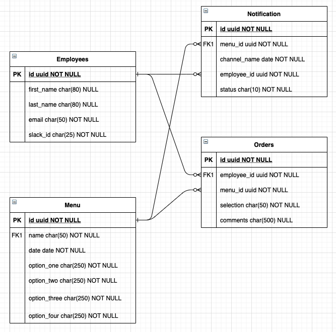

### API

The CRUD operations are done with the following endpoints:

lunch/urls.py

```
  path("", login_required(TemplateView.as_view(template_name="index.html"))),
  path("choose/<uuid:id>", ChooseView.as_view(), name="choose"),
  path("thanks", TemplateView.as_view(template_name="thanks.html")),
  path("out", TemplateView.as_view(template_name="out.html")),
  path("api/", include(router.urls)),
```

This urls are translated to:
Prefix: /lunch

- GET / <- Admin interface
- /choose
  - GET /:id
  - POST
- GET /thanks <- Success page
- GET /out <- Out of schedule page
- /api <- Web API REST
  - GET /order
  - POST /order
  - GET /employee
  - GET /menu
  - GET /menu/:id
  - POST /menu
  - PUT /menu/:id

### Asynchronous Task

When a menu is created, the lunch app triggers an asynchronous task using Celery framework. This framework is a powerful tool for implementing asynchronous tasks.

Said that, the POST method can return a 201 response but the task in charge of query all employees from the database and send an individual slack message is done in the background.

Here's a diagram that explains how this is implemented.

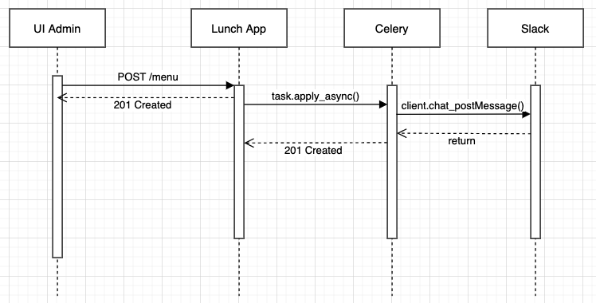

1. An Admin creates a menu
2. The menu is created on the DB and returns 201 Created
3. The lunch app queues a new task with the newly created menu id
4. The celery task query the menu from the database and all the employees
5. Iterates over the list of employees and creates a Notification record with menu and employee as a foreign key.
6. Sets the Notification as NOT_SENT
7. Gets the slack id from the employee record and post the message using an slack client
8. Sets the Notification as SENT

After all this process, the user will be prompted:

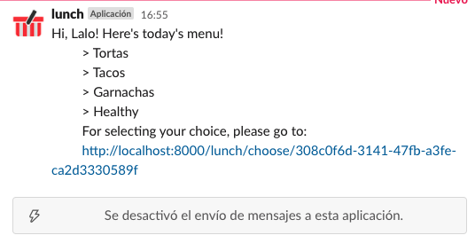

### UI

**Admin interface**

The admin interface is very straightforward, consists of a Vue app with 4 main views:

- Home

Home page with the nav bar
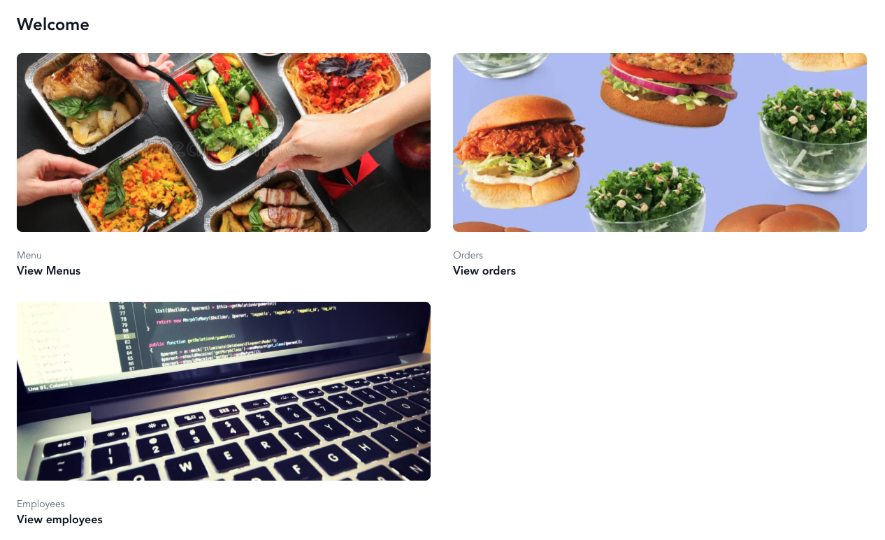


- Menus

List of week menu

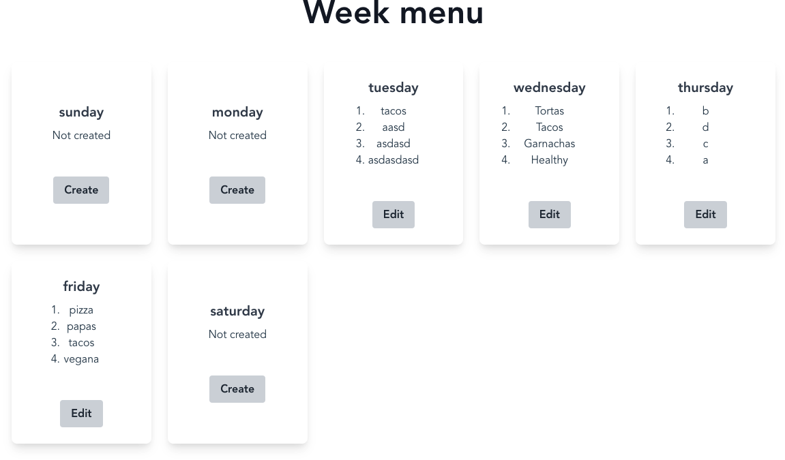

- Employees

List of employees
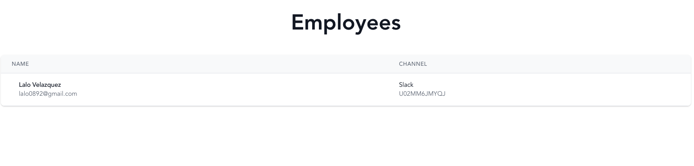

- Orders

List of orders
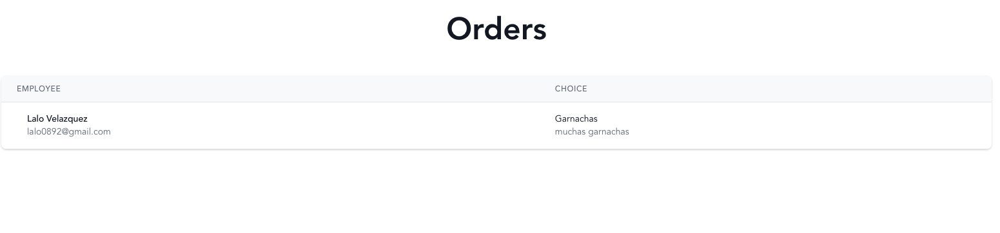


### Choose view

The choose view is the one the employee is able to see and select the menu option.

It's a simple Django template with a form.

The main action here is that the post action updated the notification as 'DONE' and the order record is created.

- Form

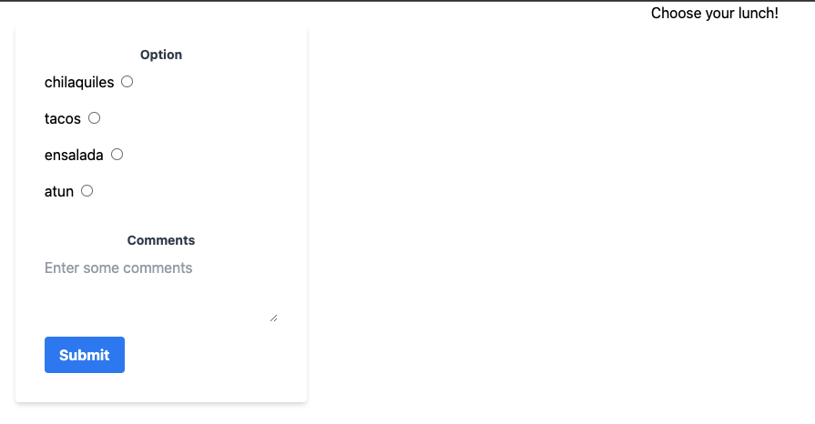

- Submit Success

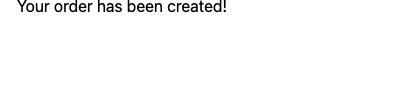

- Out of schedule

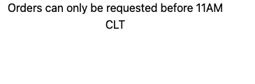
### Staticfiles

The static files are a important part of any Django project.
By default, the static files are taken from each app's static folder.

Being that said, the destination folder from the Vue app´s bundles are generated in /lunch/static

```
module.exports = {
  ...
  outputDir: '../lunch/static/lunch',
  ...
}
```

Collecstatic with

```
python manage.py collecstatic --no-input
```


## How can I run the project?

1.- Backend

- `cd cornershop-backend-test`
- `make up`

This will create the initial data (en employee with an Slack ID)
- `python manage.py runscript data` 
- `dev up`

2.- UI
- `cd cornershop-backend-test`
- `cd ui`
- `npm run serve`

3. Production

- Build ui
- `cd cornershop-backend-test`
- `cd ui`
- `npm run build`
- `cd ..`
- `make up`
- `python manage.py collecstatic`
- `dev up`


## Testing

Find unit test in lunch/tests.py and run with the following command:

If we are inside the docker container
- `dev cov`

Outside docker container

- `python manage.py test`

## Other stuff

**Adminer**

Adminer is a simply Data management application for PostgreSQL

Go to http://localhost:8081/

Enter credentials

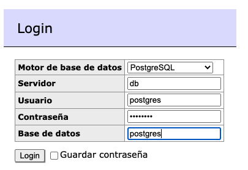

You can now visualize data and perform SQL queries

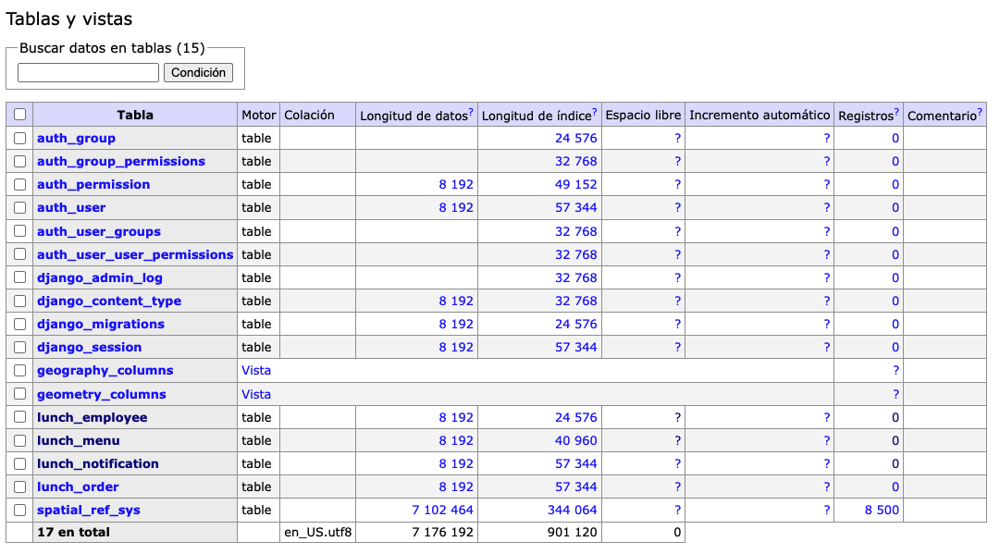


